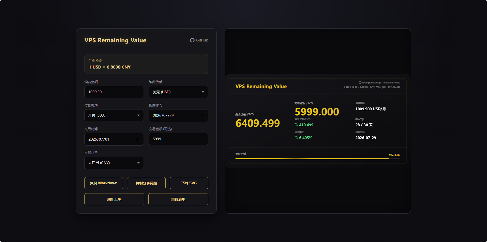

# VPS Remaining Value (VPS 剩余价值计算器)

一个用于计算 各类订阅服务剩余价值的 Web 工具，支持动态汇率转换并可生成 SVG 分享图



## SVG 预览

|  |  |
|-----------------------|-----------------------|

## 本地运行

```bash
npm install
npm run start
```

服务默认运行在 http://localhost:45867

## Docker 部署

```bash
docker build -t vps-remaining-value:latest .
docker run -d -p 45867:45867 --restart always --name vps-remaining-value vps-remaining-value:latest
```

```bash
docker run -d -p 45867:45867 --restart always --name vps-remaining-value ghcr.io/youngyannick/vps-remaining-value:latest
```

---

## Cloud Flare Worker 版本

- 原版 [vps-remaining-value-worker](vps-remaining-value-worker.js)
- 混淆 [vps-remaining-value-worker-obfuscated](vps-remaining-value-worker-obfuscated.js)

### 环境变量

| 参数         | 含义        | 获取来源                                              |
| ------------ | ----------- | ----------------------------------------------------- |
| `V6_API_KEY` | 汇率API密钥 | [Exchangerate-api](https://www.exchangerate-api.com/) |
| `SECRET_KEY` | 密钥        |                                                       |